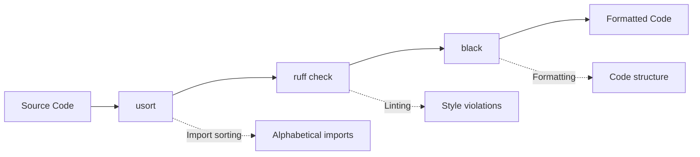

This guide covers the comprehensive code formatting and linting setup for TritonParse, ensuring consistent code quality across all contributions.

## 🎨 Formatting Tool Chain

### Primary Tools

| Tool | Purpose | Version | Configuration |
|------|---------|---------|---------------|
| **Black** | Code formatting | 24.4.2+ | `pyproject.toml` |
| **usort** | Import sorting | 1.0.8+ | `pyproject.toml` |
| **Ruff** | Linting & style checks | 0.1.0+ | Built-in rules |

### Tool Execution Order



**Why this order?**
1. **usort** - Sorts imports first (affects line numbers)
2. **ruff** - Lints and auto-fixes issues
3. **black** - Final formatting pass

## 📦 Installation

### Quick Setup (Recommended)

```bash
# Install all development dependencies
make install-dev
```

### Manual Installation

```bash
# Install tritonparse in development mode
pip install -e ".[test]"

# Install formatting tools
pip install black usort ruff
```

## 🚀 Usage Commands

### Essential Commands

```bash
# Fix all formatting issues
make format

# Check if code is properly formatted (CI-compatible)
make lint-check

# Check formatting without fixing
make format-check
```

## ⚙️ Configuration

### Configuration Summary

| Tool | Key Settings | Purpose |
|------|--------------|----------|
| **Black** | Line length: 88, Target: Python 3.10+ | PEP 8 compliant formatting |
| **usort** | First-party detection: off | Alphabetical import sorting |
| **Ruff** | Built-in rules, auto-fix enabled | Fast linting |

<details>
<summary>📄 Full Configuration Files</summary>

**pyproject.toml**:
```toml
[tool.black]
line-length = 88
target-version = ["py310"]

[tool.usort]
first_party_detection = false
```

**Makefile**:
```makefile
# Development dependencies
install-dev:
    pip install -U black usort ruff coverage

# Formatting commands
format:
    python -m tritonparse.tools.format_fix --verbose

format-check:
    python -m tritonparse.tools.format_fix --check-only --verbose

# Linting commands
lint-check:
    ruff check --diff .
    black --check --diff .

# Testing commands
test:
    python -m unittest discover -s tests/cpu -t . -v

test-cuda:
    python -m unittest discover -s tests -t . -v
```
</details>

## 🔧 Developer Workflow

### Quick Start

```bash
# 1. Make your code changes

# 2. Run formatting
make format

# 3. Verify everything is clean
make lint-check

# 4. Commit your changes
git add .
git commit -m "Your changes"
```

### Troubleshooting

**Format check fails?**
```bash
make format          # Fix issues automatically
make lint-check      # Verify fixes
```

**Need to check specific changes?**
```bash
ruff check --diff .
black --check --diff .
```

**Fix individual files:**
```bash
black path/to/file.py
usort format path/to/file.py
ruff check path/to/file.py --fix
```

**Clear tool caches:**
```bash
rm -rf .ruff_cache __pycache__
make format
```

> 💡 **Tip**: Always run `make format` before committing. CI will check formatting automatically.

## 🤖 CI Integration

### GitHub Actions Workflow

The CI pipeline includes a `format-check` job that:

1. **Installs dependencies** via `make install-dev`
2. **Checks formatting** via `make format-check`
3. **Verifies linting** via `make lint-check`
4. **Blocks merging** if formatting fails

```yaml
format-check:
  runs-on: ubuntu-latest
  steps:
    - uses: actions/checkout@v4
    - name: Set up Python 3.11
      uses: actions/setup-python@v4
      with:
        python-version: "3.11"
    - name: Install development dependencies
      run: make install-dev
    - name: Check code formatting
      run: make format-check
    - name: Check linting
      run: make lint-check
```

**CI Process**:
1. Install dependencies → `make install-dev`
2. Check formatting → `make format-check`
3. Verify linting → `make lint-check`
4. Block merge if any check fails

## 🔍 Tool Details

**Black** - Formats code structure, spacing, string quotes (double preferred), line breaks, indentation, and trailing commas. Uses 88-character line length (PEP 8 compliant).

**usort** - Sorts imports alphabetically within categories: standard library, third-party packages, and local modules. Groups imports with blank lines between categories.

**Ruff** - Fast linter that checks code style violations, unused imports, syntax errors, and type annotation issues. Auto-fixes safe issues.

### Formatting Example

```python
# Before formatting
import triton
import os
import torch
from pathlib import Path
def my_function(x,y,z):
    return x+y+z

# After: usort → ruff → black
import os
from pathlib import Path

import torch
import triton


def my_function(x, y, z):
    return x + y + z
```

## 🚨 Common Issues

| Issue | Error Message | Quick Fix |
|-------|---------------|----------|
| **Import Order** | `E402: Module level import not at top of file` | Move all imports to file top, before code |
| **Black vs Ruff** | Conflicting format suggestions | Run `make format` (Black takes precedence) |
| **Import Sorting** | usort breaks functionality | Use `# usort: skip` comment for file/import |
| **Line Length** | Line exceeds 88 characters | Use parentheses for multi-line breaks |

### Example Solutions

**Import Order**:
```python
# Wrong
print("Starting")
import os

# Correct
import os
print("Starting")
```

**Line Length**:
```python
# Use parentheses
result = some_function(
    very_long_argument,
    another_argument,
    third_argument
)

# Split strings
message = (
    "Long message that would "
    "exceed line length"
)
```

**Skip Sorting**:
```python
# usort: skip
import special_module  # usort: skip
```

## 🎯 Best Practices

### ✅ Do's

- **Run `make format`** before every commit
- **Use `make lint-check`** to verify CI compatibility
- **Follow the tool chain order**: usort → ruff → black
- **Keep line length at 88 characters** (Black default)
- **Use descriptive commit messages** for formatting changes

### ❌ Don'ts

- **Don't bypass formatting checks** in CI
- **Don't mix formatting with feature changes** in commits
- **Don't manually format code** that tools can handle
- **Don't ignore linting errors** without good reason
- **Don't modify tool configurations** without discussion

## 🔧 Editor Integration

**VS Code**: Install Black and Ruff extensions. Enable `editor.formatOnSave` in settings.

**PyCharm**: Install Black plugin, configure usort as external tool, enable Ruff inspection.

**Vim/Neovim**: Use `psf/black` and `charliermarsh/ruff-lsp` plugins with auto-format on save.

> 💡 See your editor's plugin documentation for detailed setup instructions.

## 🌍 Integration with PyTorch Ecosystem

This formatting setup follows **PyTorch ecosystem** patterns:

- **Black** for primary formatting (industry standard)
- **usort** for import management (Meta/Facebook standard)
- **Ruff** for fast linting (modern Python tooling)
- **88-character line length** (Black default)

## 🆘 Getting Help

For formatting issues:

1. **Check this guide** first
2. **Run `make format`** and `make lint-check`
3. **Review the [troubleshooting section](#-common-issues)**
4. **Check CI logs** for specific errors
5. **Ask in [GitHub Discussions](https://github.com/meta-pytorch/tritonparse/discussions)**

## 📚 Related Documentation

- [Developer Guide](04.-Developer-Guide.md) - Complete development workflow
- [Contributing](04.-Developer-Guide.md#-contributing-guidelines) - Contribution guidelines
- [Python API Reference](08.-Python-API-Reference.md) - API documentation
- [Installation](01.-Installation.md) - Development setup
- [GitHub Issues](https://github.com/meta-pytorch/tritonparse/issues) - Report formatting bugs

---

**Note**: This formatting setup ensures consistent code quality across all contributions. When in doubt, run `make format` followed by `make lint-check` to resolve most issues automatically.
