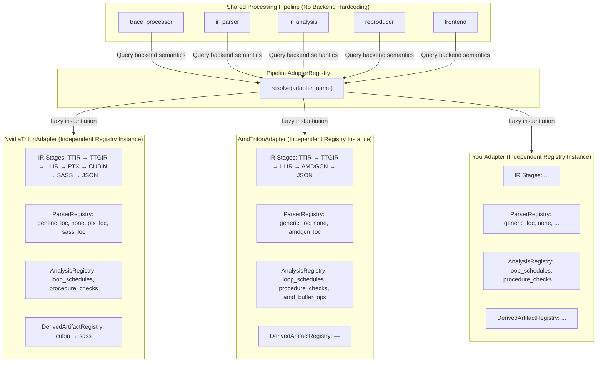

# Adding a New Backend

TritonParse supports multiple hardware backends through its Adapter architecture. If a backend is not yet supported out of the box, simply implement an Adapter subclass and register it — no modifications to TritonParse's shared core code are required.

## 📊 Currently Built-in Backends

| adapter_name | runtime_backend | Hardware Platform | Compilation Stages |
|---|---|---|---|
| `cuda_triton` | `cuda` | NVIDIA GPU | 7 (TTIR → TTGIR → LLIR → PTX → CUBIN → SASS → JSON) |
| `hip_triton` | `hip` | AMD GPU (ROCm) | 5 (TTIR → TTGIR → LLIR → AMDGCN → JSON) |
| `cann_triton` | `cann` | Ascend NPU | 6 (TTIR → TTAdapter → MLIRBC → BCMLIR → NPUBIN → JSON) |

## 🏗️ Architecture Overview

`PipelineAdapterRegistry` manages all registered Adapter classes with lazy instantiation on demand. Each Adapter instance holds independent Registry instances (ParserRegistry, AnalysisRegistry, DerivedArtifactRegistry), fully isolated between backends. TritonParse's shared processing pipeline contains no backend hardcoding — it queries Adapters for all backend-specific semantics.



## 🚀 Quick Start: Ascend NPU Example

Here is the complete implementation of `AscendTritonAdapter` (located in `tritonparse/backend.py`):

```python
class AscendTritonAdapter(CompilationPipelineAdapter):
    adapter_name: str = "cann_triton"
    runtime_backend: str = "cann"
    pytorch_module: str = "npu"

    def __init__(self):
        super().__init__()

        self._stages = [
            IRStageDescriptor("ttir",      ".ttir",      "TTIR",      10, True,  True,  "generic_loc", "mlir"),
            IRStageDescriptor("ttadapter", ".ttadapter", "TTAdapter", 20, True,  True,  "generic_loc", "mlir"),
            IRStageDescriptor("mlirbc",    ".mlirbc",    "MLIRBC",    30, False, False, "none",        "plaintext"),
            IRStageDescriptor("bcmlir",    ".bcmlir",    "BCMLIR",    40, True,  True,  "generic_loc", "mlir"),
            IRStageDescriptor("npubin",    ".npubin",    "NPUBIN",    50, False, False, "none",        "plaintext"),
            IRStageDescriptor("json",      ".json",      "JSON",     100, True,  False, "none",        "json"),
        ]
```

Register it in the module-level registration section of the same file:

```python
_REGISTRY.register(AscendTritonAdapter)
```

Verify the registration with the following command:

```bash
python -c "
from tritonparse.backend import get_backend_registry
adapter = get_backend_registry().resolve_from_backend_name('your_backend_name')
for stage in adapter.list_ir_stages():
    print(f'{stage.name:12s} {stage.extension:12s} {stage.display_name}')
"
```

This completes the integration of a basic new backend. The Step 1–6 sections below explain each part in detail. Step 1 and Step 2 are required, while Step 3–5 are optional depending on the backend's needs.

---

## 🔧 Step 1: Define Compilation Stages (IR Stages)

Each compilation stage is described by an `IRStageDescriptor`. This is the core data structure that TritonParse uses to understand the compilation pipeline.

```python
@dataclass(frozen=True)
class IRStageDescriptor:
    name: str
    extension: str
    display_name: str
    display_order: int
    is_text: bool
    supports_source_mapping: bool
    parser_id: str
    syntax_id: str
```

**Fields:**

| Field | Type | Description |
|-------|------|-------------|
| `name` | `str` | Stage name, used for lookup and matching throughout the processing pipeline (e.g., `"ttir"`, `"ptx"`). |
| `extension` | `str` | File extension used to match artifacts in the trace's `file_content` (e.g., `".ttir"`). |
| `display_name` | `str` | Display name used in the frontend UI tabs and dropdown menus (e.g., `"TTIR"`, `"PTX"`). |
| `display_order` | `int` | Display order; lower values appear first. Use multiples of 10; use 100 for metadata like JSON. |
| `is_text` | `bool` | Text format flag. `True` means the IR is in text format and can be read directly; `False` means binary format (e.g., `.cubin`) and extraction is skipped. |
| `supports_source_mapping` | `bool` | Source mapping flag. `True` means this stage's IR contains line number information and supports cross-stage source mapping, displayed in the frontend Source Mapping panel. |
| `parser_id` | `str` | Parser identifier used to extract source mappings. See [Step 3](#-step-3-register-ir-parser-optional) for built-in values. |
| `syntax_id` | `str` | Syntax highlighting identifier used by the frontend Monaco Editor. Accepted values: `"mlir"`, `"llvm"`, `"asm"`, `"ptx"`, `"json"`, `"plaintext"`. |

## 🏷️ Step 2: Set Backend Metadata

The Adapter's three class attributes define the backend's basic identity:

```python
class YourAdapter(CompilationPipelineAdapter):
    adapter_name: str = "your_backend_pipeline_name"
    runtime_backend: str = "your_backend"
    pytorch_module: str = "your_device_prefix"
```

| Attribute | Description |
|-----------|-------------|
| `adapter_name` | The combined identifier of the target runtime backend and compilation chain type. Naming convention: `"{runtime_backend}_triton"`. |
| `runtime_backend` | The target runtime backend. Must match the `backend_name` defined in the target backend's Triton compiler implementation. |
| `pytorch_module` | The PyTorch device module name, i.e., the part after `torch.` in code. |

### Reference Implementation

```python
class NvidiaTritonAdapter(CompilationPipelineAdapter):
    adapter_name: str = "cuda_triton"
    runtime_backend: str = "cuda"
    pytorch_module: str = "cuda"


class AscendTritonAdapter(CompilationPipelineAdapter):
    adapter_name: str = "cann_triton"
    runtime_backend: str = "cann"
    pytorch_module: str = "npu"
```

## 🔍 Step 3: Register IR Parser (Optional)

The Parser extracts line number mappings from IR text, enabling the frontend to highlight corresponding code lines across different compilation stages (the Source Mapping feature).

TritonParse includes two built-in Parsers:
- `"generic_loc"` — Parses MLIR-style line number annotations `loc("file":line:col)`, applicable to most text IR (TTIR, TTGIR, LLIR, etc.)
- `"none"` — No parsing, used for binary artifacts or formats without line number information

If the backend uses a line number annotation format different from MLIR, register a custom Parser.

### Function Signature and Registration

The following example defines a Parser function named `_parse_your_ir_loc` and registers it in the Adapter's `__init__`. Once registered, reference it via `parser_id` in `IRStageDescriptor`:

```python
# tritonparse/parse/ir_parser.py
def _parse_your_ir_loc(
    ir_content: str,
    other_mappings: list | None = None,
    ir_type: str | None = None,
) -> dict[str, dict[str, Any]]:
    ...
```

**Parameters:**

| Parameter | Type | Default | Description |
|-----------|------|---------|-------------|
| `ir_content` | `str` | Required | The IR text content to parse. |
| `other_mappings` | `Optional[list]` | `None` | Mapping results from previous stages, useful for cross-referencing. |
| `ir_type` | `Optional[str]` | `None` | IR type identifier (e.g., `"ptx"`), allowing one function to handle multiple formats. |

**Returns:** `dict[str, dict[str, Any]]` — A line number mapping dict formatted as `{line_identifier: {source_file_info}}`.

```python
# tritonparse/backend.py
class YourAdapter(CompilationPipelineAdapter):
    def __init__(self):
        super().__init__()

        # Register backend-specific parser
        self.register_backend_parser("your_ir_loc", _parse_your_ir_loc)

        self._stages = [
            IRStageDescriptor(
                "your_ir", ".your_ir", "YourIR", 30,
                True, True,
                "your_ir_loc",  # ← References the parser_id registered above
                "mlir"
            ),
        ]
```

### Reference Implementation

Built-in Parser implementations are located in [ir_parser.py](../tritonparse/parse/ir_parser.py):
- `_parse_generic_loc` — Generic MLIR-style line number parsing (recommended as an introductory reference)
- `_parse_ptx_loc` — PTX format line number parsing (NVIDIA-specific, demonstrates handling non-MLIR formats)
- `_parse_amdgcn_loc` — AMDGCN format line number parsing (AMD-specific)
- `_parse_sass_loc` — SASS format line number parsing (NVIDIA-specific)

## 📈 Step 4: Register IR Analysis (Optional)

Analyzers perform in-depth analysis on IR (e.g., detecting specific instruction patterns, performance bottleneck hints), with results displayed in the frontend IR Analysis panel.

Analyzers run at one of two **levels**:

- **Compile-level** — results depend only on the compiled kernel's IR artifacts.
  Emitted once per kernel hash in the `ir_analysis` event. Registered with
  `register_backend_analyzer(...)` (the default `level` is `"compile"`).
- **Launch-level** — results depend on each kernel launch's grid and input sizes
  (e.g. `roofline`). Emitted as a per-analyzer launch-level event. Registered
  with `register_backend_launch_analyzer(...)`. The launches are supplied to the
  analyzer via `AnalyzerContext.launches_with_indices`.

Both levels are controlled uniformly by the `TRITONPARSE_ANALYSIS` environment
variable and validated against the same per-adapter registry.

TritonParse includes these built-in Analyzers:
- `"loop_schedules"` — Loop schedule analysis (compile-level; depends on `ttir` + `ttgir`)
- `"procedure_checks"` — Procedure check analysis (compile-level; depends on `ttgir`)
- `"roofline"` — Per-launch bytes/FLOPs roofline (launch-level; depends on `ttir`).
  Because the bytes/FLOPs moved by a kernel depend on each launch's grid and input
  sizes, roofline joins the per-CTA TTIR template with each launch's grid and tensor
  arg sizes. See `_analyze_roofline` / `generate_roofline` in
  `tritonparse/parse/ir_analysis.py`.

If the backend requires specialized analysis capabilities, register a custom Analyzer.

### Function Signature and Registration

The following example defines an Analyzer function named `_analyze_your_ir_pattern` and registers it in the Adapter's `__init__`. `required_stages` declares the compilation stages this Analyzer depends on — the Analyzer is only executed when all dependent stage artifacts are present in the trace:

```python
# tritonparse/parse/ir_analysis.py
def _analyze_your_ir_pattern(
    entry: dict[str, Any],
    ctx: AnalyzerContext,
) -> dict[str, Any] | None:
    ...
```

**Parameters:**

| Parameter | Type | Default | Description |
|-----------|------|---------|-------------|
| `entry` | `dict[str, Any]` | Required | Trace event, containing all IR artifacts in the payload. |
| `ctx` | `AnalyzerContext` | Required | Per-call context object, containing `procedure_checks` and other configs. |

**Returns:** `Optional[dict[str, Any]]` — Analysis result dict; return `None` for no result or unmet conditions.

```python
# tritonparse/backend.py
class YourAdapter(CompilationPipelineAdapter):
    def __init__(self):
        super().__init__()

        self.register_backend_analyzer(
            analyzer_id="your_ir_pattern",
            analyzer_func=_analyze_your_ir_pattern,
            required_stages=("your_ir",),
        )

        self._stages = [
            IRStageDescriptor(
                "your_ir", ".your_ir", "YourIR", 30,
                True, True,
                "your_ir_loc",
                "mlir"
            ),
        ]
```

> 💡 **Note**: Users can control which Analyzers are enabled via the `TRITONPARSE_ANALYSIS` environment variable. See [Environment Variables Reference](07.-Environment-Variables-Reference.md) for details.

### Launch-Level Analyzers

When an analysis depends on each kernel **launch** (its grid and input sizes) rather than only on the compiled kernel, register it as a **launch-level** analyzer with `register_backend_launch_analyzer(...)`. The analyzer function uses the same `(entry, ctx)` signature, but reads this kernel's launches from `ctx.launches_with_indices` (a list of `(launch_event, launch_index)` tuples). `required_stages` still gates execution on the presence of the listed compilation stages (the launch-level analyzer reads those IR artifacts from `entry`, then scales per launch).

```python
# tritonparse/parse/ir_analysis.py
def _analyze_your_launch_metric(
    entry: dict[str, Any],
    ctx: AnalyzerContext,
) -> dict[str, Any] | None:
    launches_with_indices = ctx.launches_with_indices
    if not launches_with_indices:
        return None
    # ... compute a per-launch result joining IR artifacts in `entry` with each launch ...
    return {"your_launch_metric": result}
```

```python
# tritonparse/backend.py
class YourAdapter(CompilationPipelineAdapter):
    def __init__(self):
        super().__init__()

        self.register_backend_launch_analyzer(
            analyzer_id="your_launch_metric",
            analyzer_func=_analyze_your_launch_metric,
            required_stages=("ttir",),
        )
```

Each launch-level analyzer's result is emitted by `trace_processor` as its **own event**, whereas compile-level analyzers are merged into a single per-kernel `ir_analysis` event. Two contracts follow from this:

- **Return exactly `{analyzer_id: payload}`** — the single result key must equal the registered `analyzer_id`. That key becomes the event's `event_type` (and the payload field name), so `"your_launch_metric"` above must match the registration. The dispatch warns and skips an analyzer that returns a different or multi-key result.
- **Register a schema for the event type** — add `"<analyzer_id>": "<analyzer_id>.schema.json"` to `_SCHEMA_FILES` in `tritonparse/validation/schemas/schema_loader.py` and ship the schema file, or the emitted event will not be validated (see `roofline.schema.json` for an example).

### Reference Implementation

Built-in Analyzer implementations are located in [ir_analysis.py](../tritonparse/parse/ir_analysis.py):
- `_analyze_loop_schedules_generic` — Generic loop schedule analysis (compile-level; recommended as an introductory reference)
- `_analyze_procedures_generic` — Generic procedure check analysis (compile-level)
- `_analyze_amd_buffer_ops` — AMD Buffer Operations analysis (compile-level, AMD-specific, demonstrates how to write backend-specific analysis)
- `_analyze_roofline` — Per-launch roofline analysis (launch-level, demonstrates reading `ctx.launches_with_indices`)

## 🔗 Step 5: Register Derived Artifact (Optional)

Derived Artifacts generate new IR stages from existing compilation artifacts. A typical use case: binary artifacts (e.g., CUBIN) are not directly readable and need to be disassembled into readable text IR (e.g., SASS) using external tools (e.g., `nvdisasm`).

If the backend does not require "deriving text IR from binary artifacts," skip this step.

### Function Signature and Registration

The following example defines a derive function `_derive_your_asm` that takes the file path of `your_bin` (binary artifact) and calls an external tool to convert it into `your_asm` (readable text IR). The stage corresponding to `target_stage_name` must also be defined in `_stages`:

```python
# tritonparse/tools/your_disasm.py
def _derive_your_asm(source_file_path: str) -> str | None:
    """
    Derives your_asm (readable text IR) from your_bin (binary artifact).
    Receives the disk path of the source artifact file and returns the derived text content.
    Returns None if the external tool is unavailable or conversion fails.
    """
```

**Parameters:**

| Parameter | Type | Default | Description |
|-----------|------|---------|-------------|
| `source_file_path` | `str` | Required | Disk path of the source artifact file (binary artifact). |

**Returns:** `Optional[str]` — The derived text content, or `None` if the external tool is unavailable or conversion fails.

```python
# tritonparse/backend.py
class YourAdapter(CompilationPipelineAdapter):
    def __init__(self):
        super().__init__()

        # Import and register the derive function
        from tritonparse.tools.your_disasm import _derive_your_asm

        self.register_backend_derived_artifact(
            target_stage_name="your_asm",          # Target stage name (derived text IR)
            source_stage_name="your_bin",          # Source stage name (binary artifact)
            tool_name="your_disassembler",         # Tool name (used for log messages)
            derive_func=_derive_your_asm,
        )

        self._stages = [
            # ...
            IRStageDescriptor("your_bin", ".your_bin", "YourBin", 40, False, False, "none", "plaintext"),
            IRStageDescriptor("your_asm", ".your_asm", "YourAsm", 50, True, True, "your_asm_loc", "asm"),
            # ...
        ]
```

> 💡 **Note**: Users can control which Derived Artifacts are enabled via the `TRITONPARSE_DERIVED_ARTIFACTS` environment variable. See [Environment Variables Reference](07.-Environment-Variables-Reference.md) for details.

### Reference Implementation

NVIDIA's CUBIN → SASS derivation in `NvidiaTritonAdapter`:

```python
class NvidiaTritonAdapter(CompilationPipelineAdapter):
    def __init__(self):
        super().__init__()
        # ...
        from tritonparse.tools.disasm import extract as derive_sass

        self.register_backend_derived_artifact(
            target_stage_name="sass",
            source_stage_name="cubin",
            tool_name="nvdisasm",
            derive_func=derive_sass,
        )

        self._stages = [
            # ...
            IRStageDescriptor("cubin", ".cubin", "CUBIN", 50, False, False, "none", "plaintext"),
            IRStageDescriptor("sass",  ".sass",  "SASS",  60, True,  True,  "sass_loc", "asm"),
            # ...
        ]
```

The `extract` function in [disasm.py](../tritonparse/tools/disasm.py) calls `nvdisasm` to disassemble CUBIN into SASS, then parses the output to extract function-level assembly code.

## ✅ Step 6: Register with PipelineAdapterRegistry

Once the Adapter is complete, register it with the global Registry in the module-level registration section of `tritonparse/backend.py`:

```python
_REGISTRY.register(YourAdapter)
```

TritonParse automatically looks up the corresponding Adapter via `metadata.backend_name` when parsing traces — no manual invocation needed. Ensure the compilation pipeline correctly sets the `metadata.backend_name` field when generating traces. For example, with Ascend, the trace should contain:

```json
{
  "metadata": {
    "backend_name": "cann"
  }
}
```

---

## 📚 Related Documentation

- [Developer Guide](04.-Developer-Guide.md) - TritonParse overall architecture and development guide
- [Environment Variables Reference](07.-Environment-Variables-Reference.md) - Configuration for `TRITONPARSE_ANALYSIS`, `TRITONPARSE_DERIVED_ARTIFACTS`, and other environment variables
- [Python API Reference](08.-Python-API-Reference.md) - Complete API documentation for `CompilationPipelineAdapter`
- [FAQ](06.-FAQ.md) - Frequently asked questions
